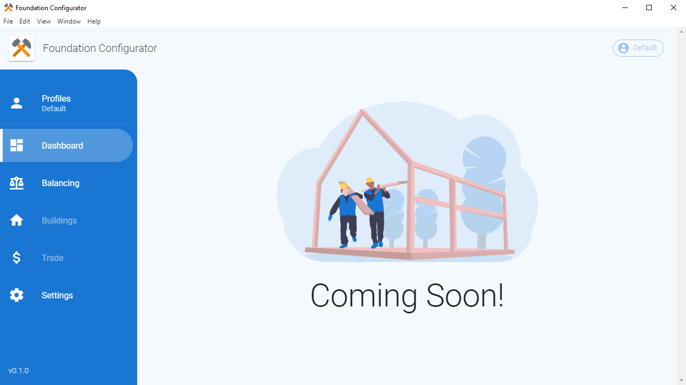

# foundation-game-configurator

> Making configuring Foundation a breeze!

  

## Description

Simple configurator tool for [Foundation](https://www.polymorph.games/) inspired by [Fiery Essentials](https://foundation.mod.io/fiery-essential) _and_ developed to help me learn Electron and TypeScript.

## Feature List

> Many of these features may never be implemented, but will serve as a brainstorming guide!

- [ ] Profile system (save/load/_share?_)
- [ ] Balancing tweaks
  - [ ] Warehouse storage limits
  - [ ] Additional sellable items (grape, etc)
  - [ ] Toggle items in status bar (top)
  - [ ] Market prices
  - [ ] Territory tax rates
- [ ] Building tweaks
  - [ ] Construction cost/time and maintenance
  - [ ] Production rates and workers
- [ ] Trading villages
  - [ ] Customize existing routes
  - [ ] Add new village routes
- [ ] Additional tweaks
  - [ ] Large list of villager names (_plus custom?_)
  - [ ] Disable welcome quests

## Attributions

This project is only possible through the help and support of some amazing people!

- [firesofhades](https://mod.io/members/firesofhades)
  - `fireofhades` provided some invaluable support to get me up and running, and graciously allowed me to study their [Fiery Essentials](https://foundation.mod.io/fiery-essential) configurator...their insightful comments saved me a lot of time and tears!

## Contributing

Contributions are definitely welcome, as this is my first experience in modding (or Electron...)! I'll be working on a `CONTRIBUTING` guideline at some point...

### Getting Started

Clone the project and install dependencies (`npm install`).

| Script | Description |
|--------|-------------|
| `npm run electron:serve` | Start Electron development environment
| `npm run electron:build` | Production build for Electron environment
| `npm run lint` | Lint code
| `npm run test:unit` | Run unit tests
| `npm run web:serve` | Start web development environment
| `npm run web:build` | Production build for web environment
